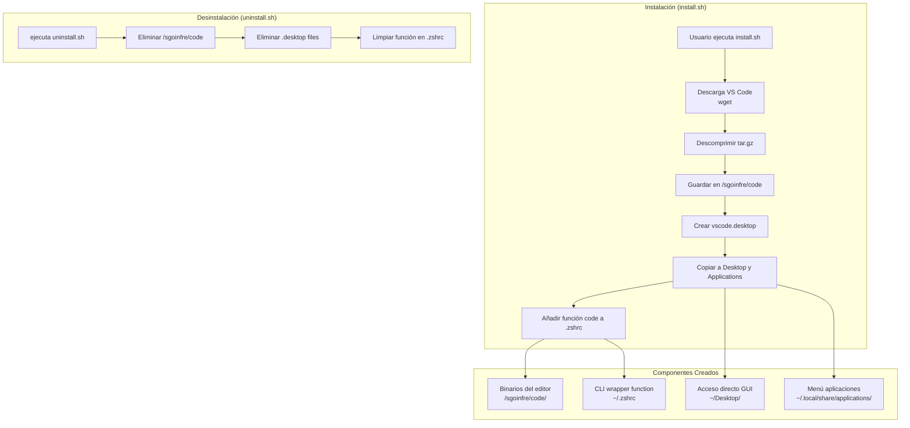

# 42 VS Code Installer Script


> Instalador automatizado de Visual Studio Code para el entorno de 42 Network. Descarga, configura e integra VS Code en el sistema sin requerir permisos de administrador.

---

## Características Principales

- Instalación automatizada de VS Code desde el servidor oficial (última versión estable)
- Integración completa con el entorno de escritorio Linux (GNOME/KDE)
- Acceso directo en el escritorio y menú de aplicaciones
- Comando `code` disponible en terminal
- Desinstalación limpia y completa
- Funciona sin permisos root en espacios de usuario (`/sgoinfre`)

## Stack Tecnológico

| Categoría | Tecnología |
|-----------|------------|
| Shell Scripting | Zsh |
| Descarga de binarios | GNU Wget |
| Descompresión | tar |
| Integración Desktop | XDG Desktop Entry Standard |

## Decisiones Técnicas / Arquitectura

Este proyecto resuelve un problema específico del entorno 42 Network: las máquinas de los clusters se reinician periódicamente, eliminando cualquier software instalado localmente. Además, los estudiantes no tienen permisos de administrador.

La arquitectura aprovecha el directorio `/sgoinfre/students/$USER`, un espacio de almacenamiento persistente entre reinicios, para instalar VS Code de forma portable. El uso de `nohup` con redirección a `/dev/null` garantiza que el editor se ejecuta como proceso independiente del terminal, evitando bloqueos de sesión. La creación dinámica del archivo `.desktop` cumple con los estándares XDG para máxima compatibilidad entre entornos de escritorio Linux.



## Guía de Instalación

```bash
# Clonar el repositorio
git clone https://github.com/samuelhm/42_VscodeInstallerScript.git
cd 42_VscodeInstallerScript

# Dar permisos de ejecución
chmod +x install.sh uninstall.sh

# Instalar VS Code
./install.sh
```

### Verificar Instalación

```bash
# Verificar que está instalado
code --version

# Abrir VS Code desde terminal
code .
```

### Desinstalar

```bash
./uninstall.sh
```

---

## Contacto

[](https://github.com/samuelhm/)
[](https://www.linkedin.com/in/shurtado-m/)